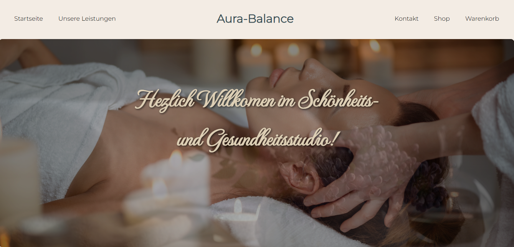

** Die Website wurde für die Lernzwecke entwickelt **

Aura-Balanace - Massage Studio
Willkommen bei **Aura-Balance**, einer modernen und benutzerfreundlichen Webanwendung für ein Massagestudio. 
Die Anwendung wurde mit **React** entwickelt und nutzt verschiedene Funktionen, um den Nutzern eine nahtlose und interaktive Erfahrung zu bieten. 

1. DEMO:
   Sie können unter  die Website https://aura-balance-massage-studio.netlify.app/ finden.
   
  
3. Funktionen:
   - Dienstleistungsbeschreibungen: Detaillierte Beschreibungen der vom Studio angebotenen Dienstleistungen.
   - Benutzer können über die Massagestudio die Information sammeln und passende Massage aussuchen.
   - Die Website bietet auch Online-Shop, wo die Kunden auch die Produkte für den Körper finden können.
   - Das Warenkorb System ermöglicht es den Benutzern, Produkte in ihrem virtuellen Warenkorb zu sammeln.
     Benutzer können die Anzahl der Artikel anpassen, Produkte entfernen und den Gesamtpreis der Bestellung jederzeit einsehen. S
   - Die Anwendung ist mobilfreundlich und sieht auf allen Bildschirmgrößen gut aus.
     
4. Verwendete Technologien:
   - React: Eine JavaScript-Bibliothek zum Erstellen von Benutzeroberflächen.
   - UI Hooks: Benutzerdefinierte Hooks zur Verwaltung von Zuständen und Interaktionen in der Benutzeroberfläche.
   - CSS-Module: Abgeschlossene CSS-Styles, um Konflikte zwischen Komponenten zu vermeiden.
   - React Router: Zur Navigation und Verwaltung verschiedener Seiten/Ansichten in der Anwendung.

5.  Lizenz:  Dieses Projekt ist unter der MIT-Lizenz lizenziert – siehe die [LICENSE](LICENSE)-Datei für Details.
